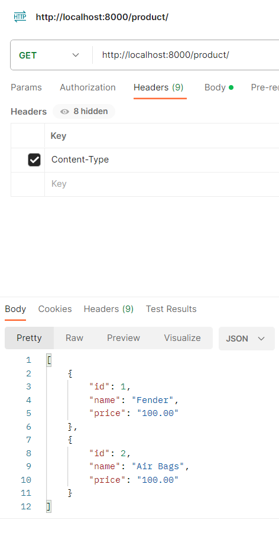
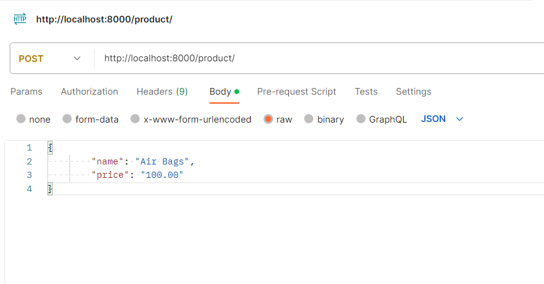
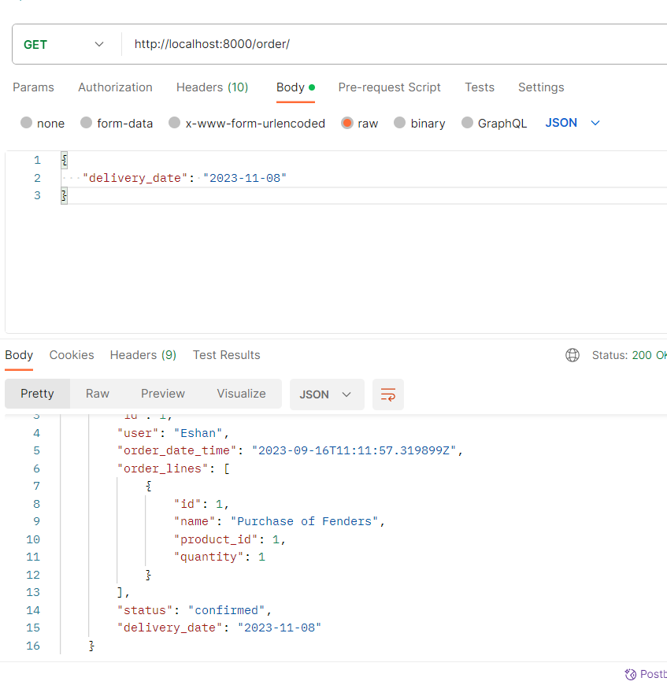
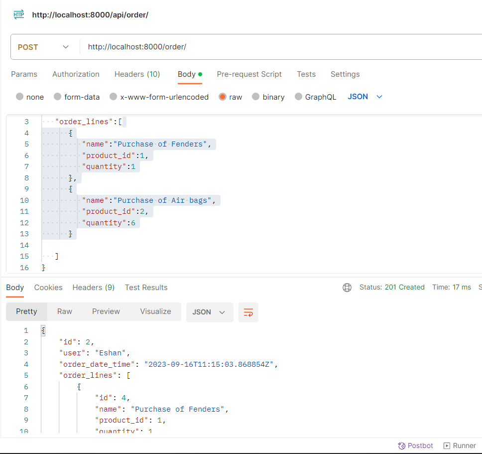
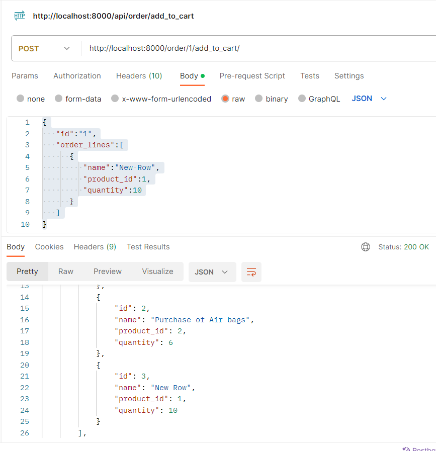
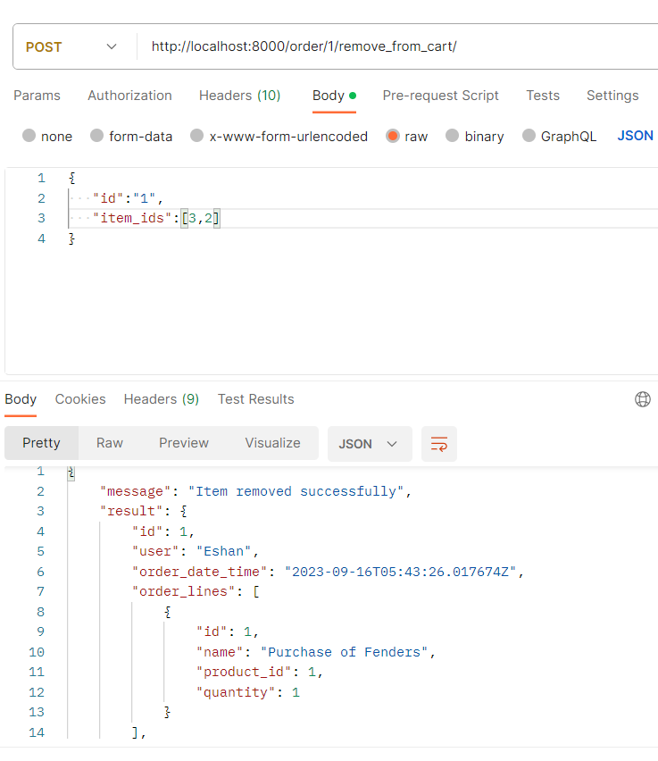
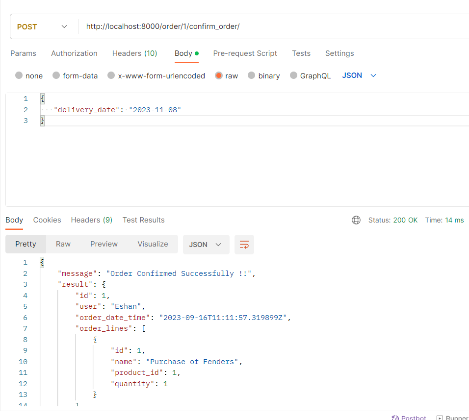

Python version and database versions are in th docker file [Dockerfile](Dockerfile).
Python libraries [requirements.txt](requirements.txt) will be auto installed when you run the below command 
You can start setup the product with this command docker-compose up -d  
Postgres Integration is in the setting files
To migrate the models to the database please use the commands in django_commands file.
Once the migrations are completed project will run in your localhost:8000
Index page itself will have the APIS.
They are product & orders
You can find the postman export here [Label A.postman_collection.json](Label%20A.postman_collection.json)

Please make sure to use application/json as content type

<h4>Get Products</h4>

<h4>Create Products</h4>

<h4>View Orders</h4>

<h4>Create Initial Order</h4>

<h4>Add to Cart</h4>

<h4>Remove from Card</h4>

<h4>Confirm Order</h4>

